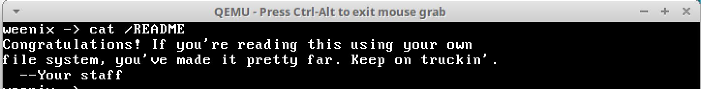

# Weenix Kernel — Demonstration

This repository showcases the results of my work on **Weenix**, a Unix-like toy kernel.  
The source code is not included (per course policy), but here you can find screenshots, recordings,  
and explanations of the kernel features we (Group of 2) implemented as part of the semested long Kernel project of the course CSCI402 at USC.

---

## Features Implemented

- **Processes & Threads**
    - Full process lifecycle
    - Thread scheduling, synchronization
    - Mutexes & wait queues

- **Virtual File System (VFS)**
    - System calls: `open`, `close`, `read`, `write`
    - File descriptor tables per process
    - Support for device files

- **Virtual Memory**
    - Page fault handler
    - `mmap()` and `brk()` implementations
    - Copy-on-write and full `fork()` pipeline

---

## Demo
#### User Shell

#### User Shell `help` command

#### User Shell `cat` command

#### Kernel Shell `help` command

#### User Shell `ls` command

#### User Shell `stat` command

#### User Shell `faber thread tests`

#### User Shell `fork-and-wait`

#### `forkbomb` test - Upto 250 child threads

#### `forkbomb` test - Upto 500 child threads

#### `memtest`

#### `stresstest`

